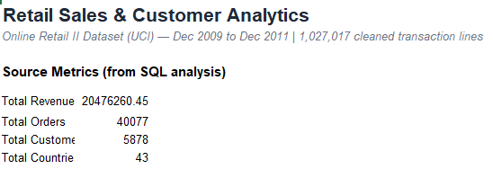

# SQL & Excel Customer Revenue Intelligence

Analysis of 2 years of transaction data (Dec 2009 – Dec 2011) for a UK-based online retailer, using SQL for analysis and Excel for stakeholder-ready reporting.



## Business Problem

The business wanted answers to three questions:
- Who are our best customers?
- Which countries aren't performing well?
- Where is the business losing money?

## Dataset

- **Size:** 1M+ transaction records
- **Scope:** ~5,878 customers across 43 countries
- **Value:** £20.48M in total sales
- **Timeframe:** December 2009 – December 2011

## Tools Used

`SQL` `MySQL / PostgreSQL` `Excel` `Pivot Tables` `RFM Segmentation`

## Approach

1. Loaded the transaction data into a relational database
2. Wrote 12 SQL queries, progressing from simple aggregates (total sales, top countries) to advanced analysis (month-over-month growth, RFM segmentation — Recency, Frequency, Monetary value)
3. Exported results into a 6-tab Excel workbook designed for non-technical stakeholders

## Key Findings

- **UK dependency risk:** the UK alone accounts for **85% of all sales (£17.4M)** — the business is heavily concentrated in one market
- **Best customers drive most revenue:** a segment of **1,814 "best" customers (~31% of the customer base)** generates **64% of total revenue**
- **Cancellation problem in 3 countries:** Japan, Channel Islands, and Italy have order cancellation rates **over 29%**, more than double the average — pointing to likely delivery or communication issues

## Recommendations

- Build a loyalty/rewards program targeting the "best customer" segment, since losing them would have the largest revenue impact
- Investigate the root cause of cancellations in Japan, Channel Islands, and Italy — estimated recoverable value: **£15,000–£20,000**
- Time marketing campaigns for **Wednesday–Thursday, 10am–3pm**, the peak purchasing window
- Explore expansion into **Netherlands and Germany**, where organic demand already exists, to reduce UK dependency

## Repository Structure

```
sql-excel-customer-revenue-intelligence/
├── README.md  (data source/download link — raw data not committed)
├── SQL_analysis_queries.sql
├── Retail_Sales_Analytics.xlsx
├── Retail_Analytics_report.docx
├── Retail_Analytics_presentation.pptx
└── dashboard_priview.png
```

## Data

Raw transaction data is not included in this repository due to size. See `data/README.md` for the source and download instructions.
